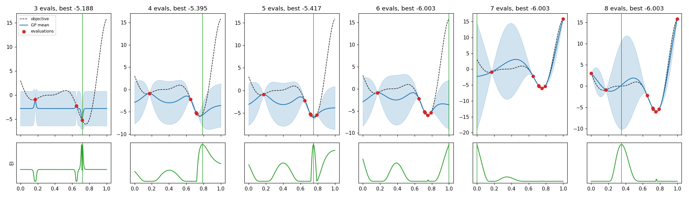

# gp_bayesopt

Gaussian process regression and Bayesian optimisation, written from first principles with nothing but NumPy and SciPy's linear algebra and L‑BFGS‑B.

Bayesian optimisation is what you reach for when a function is expensive to evaluate and has no gradient you can get at: tuning hyperparameters of a model that takes an hour to train, calibrating a simulator, choosing process settings for a physical experiment. Instead of spending hundreds of evaluations on grid or random search, it fits a probabilistic surrogate (a Gaussian process) to what it has seen so far and asks that surrogate where the next evaluation is most likely to pay off.

This repo implements the whole stack so every piece is visible and tested:

* **Kernels with analytic gradients**: RBF, Matern 3/2, Matern 5/2 (all with optional ARD, one length scale per input), a periodic kernel, a constant/scale kernel, and `+` / `*` composition, so `2.0 * Matern52([0.3, 1.0]) + 0.5 * Periodic()` just works. Hyperparameters live in log space.
* **Exact GP regression** through a single Cholesky factorisation: posterior mean, standard deviation, full covariance, and joint posterior sampling.
* **Type II maximum likelihood**: the log marginal likelihood and its exact gradient, maximised with L‑BFGS‑B plus random restarts, including a learned observation noise.
* **Acquisition functions**: closed form Expected Improvement, Probability of Improvement, and a Lower Confidence Bound.
* **A Bayesian optimiser** with an `ask` / `tell` interface, Latin hypercube initial design, unit cube input scaling, and a two stage acquisition search (dense random candidates, then gradient polishing of the best few).
* **Benchmarks** with known optima (Forrester, Branin, six hump camel, Hartmann 3) and a CLI that compares BO against random search.



*Each column is one iteration on the Forrester function. Top: GP mean, 95% band, and evaluations. Bottom: expected improvement, whose peak (green line) is evaluated next. Early on EI digs into the promising basin near 0.75; once that is pinned down, the only remaining improvement potential is in the wide uncertainty bands, so it switches to exploring.*

## Quick start

```bash
git clone https://github.com/MohammadHossinzehi/gp_bayesopt.git
cd gp_bayesopt
pip install -r requirements.txt          # numpy, scipy
python -m gpbo --benchmark branin --iters 30 --seeds 5
```

Typical output (30 evaluations per run):

```
branin: dim=2  known minimum=0.39789  budget=30 evals  acquisition=ei

seed 0:  BO regret 7.52e-02   random search regret 1.24e+00
seed 1:  BO regret 9.69e-03   random search regret 1.37e+00
seed 2:  BO regret 8.80e-02   random search regret 4.45e-01
...
```

On Hartmann 3 with the same budget, BO typically lands within 1e‑3 of the global minimum while random search is still off by 0.2 to 0.5. Other options: `--benchmark {forrester,branin,camel,hartmann3}`, `--acq {ei,pi,lcb}`, `--verbose` to print every evaluation.

### As a library

```python
import numpy as np
from gpbo import BayesianOptimizer, GaussianProcessRegressor, ConstantKernel, Matern52, Periodic

# 1. Regression with learned hyperparameters
X = np.random.rand(40, 1) * 10
y = np.sin(X[:, 0]) + 0.1 * np.random.randn(40)
gp = GaussianProcessRegressor(ConstantKernel() * Matern52(1.0), seed=0).fit(X, y)
mean, std = gp.predict(np.linspace(0, 10, 200)[:, None], return_std=True)
print(gp.kernel, "noise:", gp.noise, "log evidence:", gp.log_marginal_likelihood())

# 2. Optimise a black box
def expensive(x):
    return (x[0] - 0.3) ** 2 + np.sin(5 * x[1])

opt = BayesianOptimizer(bounds=[[-1, 1], [0, 2]], acquisition="ei", seed=0)
result = opt.minimize(expensive, n_iter=25)
print(result.x, result.fun)

# 3. Or drive it yourself (e.g. when evaluations happen elsewhere)
x = opt.ask()
opt.tell(x, expensive(x))
```

### Regenerating the figure

```bash
pip install matplotlib
python examples/visualize_bo.py     # writes bo_steps.png
```

## Running the tests

```bash
pip install -r requirements-dev.txt
python -m pytest
```

44 tests, around 20 seconds. What they pin down:

* **Every kernel gradient** (including nested sums and products) against central finite differences, plus symmetry, positive semidefiniteness, and `diag` consistency.
* **The log marginal likelihood** against a dense `slogdet` / `solve` reference, and its gradient (kernel parameters and noise) against finite differences.
* **Posterior behaviour**: exact interpolation of noiseless data, reversion to the prior far from data, calibration of the 95% band, recovery of the true noise level, and agreement between `predict(return_std)`, `predict(return_cov)` and the moments of `sample_y`.
* **Expected improvement** against a two million sample Monte Carlo estimate, plus the zero variance edge cases.
* **End to end**: Latin hypercube stratification, bound handling in `ask`, Forrester solved to within 0.05 in 12 evaluations, and BO beating random search on Branin with both EI and LCB.

## Design notes

**Log space hyperparameters.** Length scales, variances and noise are all positive and routinely span orders of magnitude. Optimising their logarithms removes the positivity constraint and makes the evidence surface much better conditioned. Each kernel returns `dK/dlog(theta)` directly, which is often simpler than the natural space derivative (for the RBF it is just `K * r^2`).

**One Cholesky, reused everywhere.** Fitting factors `K + noise I = L L^T` once. The mean uses `alpha = L^T \ (L \ y)`, the variance uses a single triangular solve per test batch, and the log determinant is `2 sum(log diag L)`. The explicit inverse only appears inside the gradient, where `tr((alpha alpha^T - K^{-1}) dK)` needs it anyway.

**Noise is a model parameter, not a kernel.** Keeping the noise variance separate from the kernel means `predict` returns uncertainty about the latent function `f`, which is what acquisition functions should reason about, rather than about noisy observations.

**Periodic kernel done properly.** The popular shortcut `exp(-2 sin^2(pi |x - y| / p) / l^2)` with a Euclidean `|x - y|` is not positive semidefinite in more than one dimension. The PSD test caught this during development (an eigenvalue of about 0.36 below zero on random 3D inputs), so the implementation sums `sin^2` per dimension instead, which is a product of valid 1D kernels.

**Unit cube inputs and normalised outputs.** The optimiser maps the search box to `[0, 1]^d` and the GP standardises targets, so one set of default bounds (length scale 0.01 to 10, signal variance 0.01 to 100) works for Branin's `[-5, 10] x [0, 15]` as well as Hartmann's unit cube.

**Acquisition search.** EI is highly multimodal and flat in large regions, so pure gradient ascent from one start is unreliable. The optimiser scores 2000 random candidates, then polishes the best five with L‑BFGS‑B. If the winner coincides with an existing point (which would make the kernel matrix singular), it falls back to a random point.

**Warm starts.** Each iteration refits the GP starting from the previous iteration's hyperparameters plus a couple of random restarts. That keeps the fit stable as data trickles in while still allowing escape from a bad local optimum of the evidence.

**Known limitations.** Exact GPs cost O(n^3) per fit, so this is aimed at the tens to low hundreds of evaluations that BO is normally used for. There is no batch (parallel) acquisition and no handling of categorical inputs.

## Layout

```
gpbo/
  kernels.py      covariance functions and composition, analytic gradients
  gp.py           GaussianProcessRegressor: fit, predict, evidence, sampling
  acquisition.py  EI, PI, LCB
  optimizer.py    BayesianOptimizer (ask/tell), Latin hypercube, random search baseline
  benchmarks.py   test functions with known minima
  __main__.py     CLI: python -m gpbo
examples/visualize_bo.py
tests/            kernels, GP, and BO test suites
```

## References

* C. E. Rasmussen and C. K. I. Williams, *Gaussian Processes for Machine Learning*, MIT Press, 2006. Algorithm 2.1 and chapter 5.
* D. R. Jones, M. Schonlau, W. J. Welch, *Efficient Global Optimization of Expensive Black Box Functions*, 1998.
* J. Snoek, H. Larochelle, R. P. Adams, *Practical Bayesian Optimization of Machine Learning Algorithms*, NeurIPS 2012.

## License

MIT
